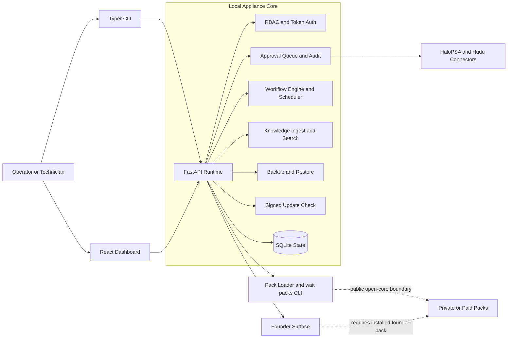
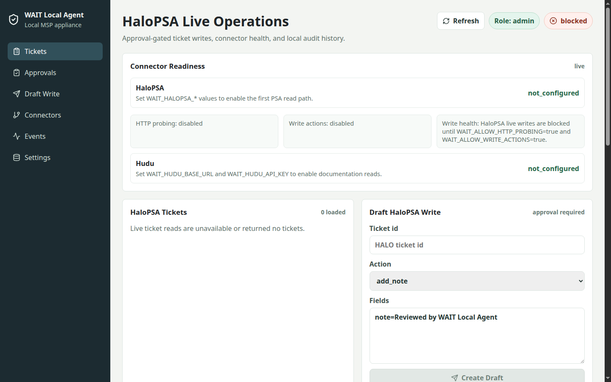
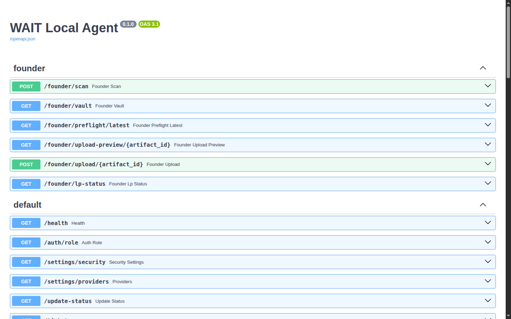

# WAIT Local Agent

[](https://github.com/W-A-I-T/wait-local-agent/actions/workflows/test.yml)
[](LICENSE)
[](pyproject.toml)

**Local-first MSP and founder automation appliance for tickets, runbooks, approvals, safe connector drafts, and auditable workflows.**

WAIT Local Agent is an Apache 2.0, self-hosted runtime for operators who want inspectable local automation instead of a cloud-first control plane. The public repo ships the local appliance: FastAPI API, Typer CLI, React dashboard, SQLite state, approval-gated connector actions, scheduled workflows, signed update checks, and open-core pack loading.

> **Safety guarantee:** live PSA writes require explicit operator opt-in (`WAIT_ALLOW_WRITE_ACTIONS=true`) and a human-approved approval request. Fresh installs stay read-first and local by default.

## Architecture



## What Ships In 1.0.0

- FastAPI operator API, Typer CLI, and React dashboard for local operation.
- RBAC-backed bearer token auth with admin, technician, and viewer roles.
- SQLite-backed tickets, documents, approvals, audit events, workflow runs, and scheduled jobs.
- Tenant and client scoping on stored workflow, approval, and event views.
- Approval queue with payload preview, field edits, approver identity capture, approve/reject, and execution history.
- HaloPSA read paths plus approval-gated write drafts and execution.
- Hudu read-only documentation context.
- Connector validation CLI for HaloPSA and Hudu credential checks.
- Markdown, text, and text-based PDF ingestion with SQLite FTS5 retrieval by default.
- Scheduled workflow registration, pause, resume, delete, and audit trail.
- Optional Fernet secret vault plus encrypted backup and restore support.
- Signed update-channel client checks.
- Open-core pack loader plus `wait-local-agent packs` install, list, and status commands.
- Founder API and CLI surface in the public repo, gated on founder pack installation.

## Open-Core Boundary

This repository contains the open core: runtime, API, CLI, dashboard, workflow engine, scheduler, HaloPSA and Hudu surfaces, pack loader, tests, docs, and release assets.

Paid or proprietary pack implementation does not belong here. Private pack work belongs in `W-A-I-T/wait-local-agent-packs` or another private repository. The local `packs/` directory remains gitignored for proprietary installs.

See [docs/open-core-boundary.md](docs/open-core-boundary.md) and [docs/commercial-model.md](docs/commercial-model.md).

## Screenshots

### Dashboard



### API Reference



## Requirements

- Python 3.12 for local CLI and API development.
- Docker with Compose support for the appliance path.
- Node.js 22 for dashboard development outside Docker.
- Optional local model endpoint such as Ollama or vLLM.

## Quick Start: Local CLI

```bash
git clone https://github.com/W-A-I-T/wait-local-agent.git
cd wait-local-agent
python3 -m venv .venv
source .venv/bin/activate
pip install -e ".[dev]"
wait-local-agent doctor
```

Run the deterministic demo:

```bash
scripts/demo_appliance.sh
```

Manual CLI checks against the shipped surface:

```bash
wait-local-agent knowledge ingest examples/sample_docs
wait-local-agent ingest examples/sample_tickets
wait-local-agent tickets summarize TCK-1002
wait-local-agent workflows templates
wait-local-agent workflows run documentation-assisted-response TCK-1002
wait-local-agent approvals list
wait-local-agent events list
wait-local-agent connectors validate halopsa
wait-local-agent update check
wait-local-agent packs status
```

## Quick Start: Docker Appliance

```bash
docker compose up --build
```

- API: `http://127.0.0.1:8788`
- Dashboard: `http://127.0.0.1:5173`
- SQLite state: Docker volume `wait-local-agent-data`

Health check:

```bash
curl http://127.0.0.1:8788/health
```

Expected conservative defaults:

```text
write_actions_enabled=false
http_probing_enabled=false
cloud_fallback_enabled=false
llm_inference_enabled=false
api_auth_required=false
```

One-command helper:

```bash
scripts/install.sh
```

## Configuration Defaults

`.env.example`, `Dockerfile`, and `docker-compose.yml` keep the appliance local and conservative by default.

```bash
WAIT_DATA_PATH=.wait-local-agent/state.db
WAIT_ALLOWED_DOC_ROOT=examples/sample_docs
WAIT_API_TOKEN=
WAIT_ADMIN_TOKEN=
WAIT_TECH_TOKEN=
WAIT_VIEWER_TOKEN=
WAIT_DEMO_MODE=true
WAIT_SECRETS_BACKEND=env
WAIT_VAULT_PATH=.wait-local-agent/vault
WAIT_ALLOW_WRITE_ACTIONS=false
WAIT_ALLOW_HTTP_PROBING=false
WAIT_ALLOW_CLOUD_FALLBACK=false
WAIT_ALLOW_LLM_INFERENCE=false
WAIT_LOCAL_MODEL_PROVIDER=deterministic
WAIT_LOCAL_MODEL_BASE_URL=http://127.0.0.1:11434/v1
WAIT_LOCAL_MODEL_NAME=llama3.1
WAIT_LOCAL_MODEL_TIMEOUT_SECONDS=20
WAIT_VECTOR_BACKEND=sqlite
WAIT_DOCUMENT_PARSER=basic
WAIT_ALLOW_OCR=false
WAIT_EMBEDDING_PROVIDER=none
WAIT_EMBEDDING_MODEL=BAAI/bge-small-en-v1.5
WAIT_QDRANT_PATH=.wait-local-agent/qdrant
WAIT_QDRANT_URL=
WAIT_QDRANT_COLLECTION=wait_knowledge_chunks
WAIT_CONNECTOR_TIMEOUT_SECONDS=20
WAIT_SCHEDULER_ENABLED=true
WAIT_RATE_LIMIT_ENABLED=true
WAIT_RATE_LIMIT_GENERAL=100/minute
WAIT_RATE_LIMIT_CONNECTOR=10/minute
WAIT_UPDATE_CHANNEL_URL=
WAIT_UPDATE_PUBKEYS=
WAIT_HALOPSA_BASE_URL=
WAIT_HALOPSA_CLIENT_ID=
WAIT_HALOPSA_CLIENT_SECRET=
WAIT_HALOPSA_TENANT=
WAIT_HALOPSA_TOKEN_URL=
WAIT_HALOPSA_TICKET_WRITE_ENDPOINT=Ticket
WAIT_HALOPSA_ACTION_WRITE_ENDPOINT=Actions
WAIT_HUDU_BASE_URL=
WAIT_HUDU_API_KEY=
WAIT_HUDU_PAGE_SIZE=25
WAIT_LICENSE_KEY=
WAIT_LICENSE_SECRET=
```

## Authentication and Roles

Local demo mode allows unauthenticated local API access only when both conditions are true:

```text
WAIT_DEMO_MODE=true
WAIT_API_TOKEN=
```

For any shared host or production-style install, configure bearer tokens and use role-specific credentials:

```bash
WAIT_DEMO_MODE=false
WAIT_API_TOKEN=<strong-local-token>
WAIT_ADMIN_TOKEN=<strong-admin-token>
WAIT_TECH_TOKEN=<strong-tech-token>
WAIT_VIEWER_TOKEN=<strong-viewer-token>
wait-local-agent serve
curl -H 'Authorization: Bearer <strong-local-token>' http://127.0.0.1:8788/health
```

## Secrets Vault and Encrypted Backups

Environment variables remain the default for local demos. For longer-lived connector credentials and encrypted backups:

```bash
WAIT_SECRETS_BACKEND=fernet
WAIT_VAULT_PATH=.wait-local-agent/vault
wait-local-agent secrets init
wait-local-agent secrets set WAIT_HALOPSA_CLIENT_SECRET '<secret>'
wait-local-agent secrets set WAIT_BACKUP_FERNET_KEY '<fernet-key>'
wait-local-agent backup create .wait-local-agent/backups/state.db.enc --encrypt
wait-local-agent backup restore .wait-local-agent/backups/state.db.enc --encrypted
```

`wait-local-agent secrets list` prints key names only. Treat `wait-local-agent secrets get` output as sensitive terminal output.

## HaloPSA Connector

Reads require credentials and `WAIT_ALLOW_HTTP_PROBING=true`:

```bash
wait-local-agent connectors halopsa-health
wait-local-agent connectors halopsa-tickets
wait-local-agent connectors halopsa-ticket HALO-1002
wait-local-agent connectors halopsa-notes HALO-1002
wait-local-agent connectors halopsa-clients
wait-local-agent connectors halopsa-categories
```

Writes require credentials, `WAIT_ALLOW_HTTP_PROBING=true`, `WAIT_ALLOW_WRITE_ACTIONS=true`, a draft, and human approval:

```bash
wait-local-agent connectors draft-halopsa HALO-1002 add_note \
  --field note="Internal note ready for review"
wait-local-agent approvals show 1
wait-local-agent approvals edit-field 1 note="Reviewed by technician"
wait-local-agent approvals update 1 approved "approved by technician"
wait-local-agent connectors execute-halopsa 1
```

Execution records sanitized metadata only: request id, action type, status, endpoint, HTTP status code, remote id when available, and concise result message.

## Hudu Connector

Hudu remains read-only documentation context in the public repo.

```bash
wait-local-agent connectors hudu-health
wait-local-agent connectors hudu-companies
wait-local-agent connectors hudu-articles
wait-local-agent connectors hudu-article ARTICLE-1
wait-local-agent connectors hudu-folders
```

## Founders and Packs

The public repo exposes the founder API and CLI contract, but real founder workflows require an installed founder pack:

```bash
wait-local-agent founder scan /path/to/project
wait-local-agent founder preflight
wait-local-agent founder handoff --output handoff.md
wait-local-agent founder export-bundle --artifact-id art-1 --output bundle.json
wait-local-agent founder upload --artifact-id art-1
wait-local-agent packs list
wait-local-agent packs install /path/to/pack.tar.gz --license <key>
```

If the founder pack is not installed, founder commands exit with a stable install hint instead of pretending the feature is available locally.

## More Documentation

- [docs/status.md](docs/status.md)
- [docs/launch-checklist.md](docs/launch-checklist.md)
- [docs/publication-checklist.md](docs/publication-checklist.md)
- [docs/local-demo.md](docs/local-demo.md)
- [docs/appliance-install.md](docs/appliance-install.md)
- [docs/connector-setup.md](docs/connector-setup.md)
- [docs/security-model.md](docs/security-model.md)
- [docs/pack-loader.md](docs/pack-loader.md)
- [docs/update-channel.md](docs/update-channel.md)
