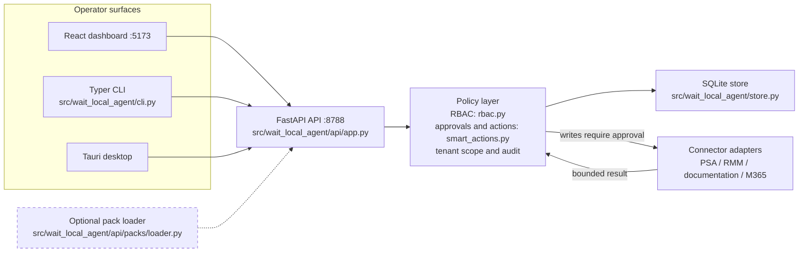
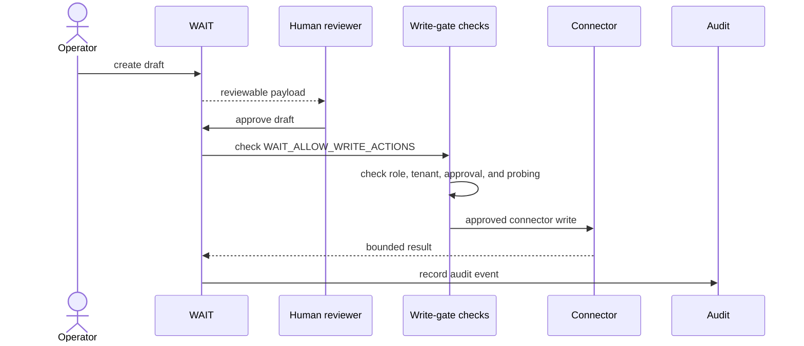

<p align="center">
  
</p>

<h1 align="center">WAIT Local Agent</h1>

<p align="center"><em>Local-first AI execution and change governance for real business systems.</em></p>

<p align="center">
  <a href="https://github.com/W-A-I-T/wait-local-agent/actions/workflows/test.yml"></a>
  <a href="LICENSE"></a>
  <a href="pyproject.toml"></a>
  <a href="CHANGELOG.md"></a>
  <a href="docs/README.md"></a>
</p>

> **License transition:** the current `main` development line is licensed as a combined work under **AGPL-3.0-only**. Source published through commit `903cb595e8f735fcc306a68f2bee150fce58a416` remains available under Apache License 2.0 on the preserved `1.x` line. See [LICENSE_HISTORY.md](LICENSE_HISTORY.md).

## What is WAIT Local Agent?

WAIT Local Agent runs on your own hardware, where your business data and
operational decisions can stay close to you. It connects to the business
systems you already use, including ticketing, documentation, and Microsoft
365. AI can help draft work from local context, while deterministic policy
controls what may happen next. Nothing writes to a live system without
explicit human approval. [Learn the architecture](docs/concepts/architecture.md).

## Screenshots

| Dashboard | Connectors and governed actions |
| --- | --- |
|  |  |
| Local operations stay visible in one reviewable workspace. | Inspect connector readiness and keep proposed changes behind the approval boundary. |

## Feature highlights

| | |
| --- | --- |
| 🔒 **Local-first**: SQLite, your hardware, and no cloud dependency. [Get started](docs/getting-started/local-demo.md) | ✅ **Approval-gated writes**: review a draft before a live mutation. [See the write gates](docs/concepts/approvals-and-write-gates.md) |
| 🔌 **14 connector entries**: bounded PSA, RMM, documentation, and Microsoft surfaces. [View the matrix](docs/connectors/README.md) | 🏢 **Microsoft 365 and Power Platform consultant lane**: source packages and reviewable plans, not provider deployment. [Explore the lane](docs/consultant/README.md) |
| 🧾 **Audit trail and evidence export**: preserve what happened and why. [Read the security model](docs/concepts/security-model.md) | 👥 **RBAC and tenant scoping**: keep operator permissions and client boundaries explicit. [Read the security model](docs/concepts/security-model.md) |
| 🖥️ **Desktop app, Docker, and CLI**: choose the local surface that fits your team. [Choose an install path](docs/getting-started/quickstart-docker.md) | 🧩 **Commercial packs**: extend the public runtime with separately licensed capabilities. [Understand editions and packs](docs/concepts/open-core-boundary.md) |

## Architecture

The operator surfaces share one API and one policy path. Connectors do not
become a second execution engine: policy checks scope, role, approval, and
outbound settings before a provider call, then records a bounded result.


```mermaid
flowchart LR
  subgraph Surfaces[Operator surfaces]
    Dashboard["React dashboard :5173"]
    CLI["Typer CLI\nsrc/wait_local_agent/cli.py"]
    Tauri["Tauri desktop"]
  end

  API["FastAPI API :8788\nsrc/wait_local_agent/api/app.py"]
  Policy["Policy layer\nRBAC: rbac.py\napprovals and actions: smart_actions.py\ntenant scope and audit"]
  Store["SQLite store\nsrc/wait_local_agent/store.py"]
  Connectors["Connector adapters\nPSA / RMM / documentation / M365"]
  Packs["Optional pack loader\nsrc/wait_local_agent/api/packs/loader.py"]

  Dashboard --> API
  CLI --> API
  Tauri --> API
  API --> Policy
  Policy --> Store
  Policy -->|writes require approval| Connectors
  Connectors -->|bounded result| Policy
  Packs -.-> API
  style Packs stroke-dasharray: 5 5
```

### What stays in the local runtime

| Part | Job | Default boundary |
| --- | --- | --- |
| Dashboard and desktop | Give an operator a visible workspace. | Served from the local machine. |
| FastAPI and CLI | Accept bounded requests and expose the same runtime services. | Local API on `127.0.0.1:8788` unless you configure otherwise. |
| SQLite store | Keep tickets, drafts, approvals, runs, knowledge, and audit events. | A local file or Docker volume. |
| Connector adapters | Read approved provider surfaces and carry out allowlisted actions. | No outbound call until probing is enabled. |

The normal path is easy to follow: start with local demo data, examine a
draft, review the policy decision, and only then choose whether a provider
connection should be enabled. A team can keep the runtime offline for
documentation, workflow, and audit work, then configure one connector at a
time as its operating practices mature.

The core modules are visible in the repository: `api/app.py` serves the API,
`cli.py` exposes the command line, `rbac.py` and `smart_actions.py` enforce
governed operations, and `store.py` persists local state. The desktop bundle
packages the existing dashboard with the local server sidecar.

## How writes are governed

WAIT starts with a local draft that a human can inspect and edit. Approval is
checked together with the operator role, tenant scope, connector readiness,
and explicit outbound settings. A live mutation also requires
`WAIT_ALLOW_WRITE_ACTIONS=true`; this flag is off by default. Successful and
blocked attempts become local audit events, and provider failures remain
failures rather than being presented as success.


```mermaid
sequenceDiagram
  actor Operator
  participant WAIT
  participant Human as Human reviewer
  participant Gate as Write-gate checks
  participant Connector
  participant Audit

  Operator->>WAIT: create draft
  WAIT-->>Human: reviewable payload
  Human->>WAIT: approve draft
  WAIT->>Gate: check WAIT_ALLOW_WRITE_ACTIONS
  Gate->>Gate: check role, tenant, approval, and probing
  Gate->>Connector: approved connector write
  Connector-->>WAIT: bounded result
  WAIT->>Audit: record audit event
```


*The approval queue is the point where a proposed change becomes eligible for
execution; the image is a local demo capture.*

The gate is deliberately repeated at execution time. Editing a draft does not
grant permission, an approval from another tenant cannot be reused, and a
provider response is not treated as evidence of success until the connector
returns a bounded result. This gives reviewers a clear local record even when
an external system is unavailable or rejects the request.

## Quickstart

### Docker

```bash
git clone https://github.com/W-A-I-T/wait-local-agent.git
cd wait-local-agent
WAIT_DEMO_MODE=true docker compose up --build
```

Open the dashboard at `http://127.0.0.1:5173`. The local demo keeps probing,
live writes, cloud fallback, and model inference disabled. [Full guide
→](docs/getting-started/quickstart-docker.md)

### Desktop

Download the installer for your operating system from [GitHub
Releases](https://github.com/W-A-I-T/wait-local-agent/releases). The desktop
bundle runs the dashboard with a local server sidecar. [Full guide
→](docs/getting-started/desktop-install.md)

### CLI

```bash
python3 -m venv .venv
source .venv/bin/activate
python -m pip install -e ".[dev]"
wait-local-agent serve
```

For the deterministic, credential-free walkthrough, run
`scripts/demo_appliance.sh` as described in the [Full guide
→](docs/getting-started/local-demo.md).

The CLI and Docker paths use the same local data model. You can start with the
demo, inspect the API and dashboard, and then move to a configured install
without creating a second runtime or migrating your workflow definitions.

### Operator authentication boundary

`WAIT_DEMO_MODE` defaults to `false`. A non-demo appliance fails to start
unless it has `WAIT_ADMIN_TOKEN`, `WAIT_API_TOKEN`, or an active persisted
`msp_admin` principal credential. Explicit demo mode is bounded to the demo
client: provider writes and deployments are disabled, and `/secrets` returns
HTTP 403.

The identity model supports principals with roles assigned per client and a
global `msp_admin` role for cross-client administration. Principal credentials
are stored as SHA-256 hashes; raw credentials are not persisted.

## Connectors

The matrix below lists the connector IDs currently returned by the runtime’s
14 `ConnectorStatus` entries. “Yes” means the connector exposes an
approval-gated write surface; “No” means the documented surface is read-only.
All outbound calls still require explicit probing, and every mutation keeps
the write flag and applicable approval checks.

| ID | Connector | Read surface | Approval-gated writes |
| --- | --- | --- | --- |
| `halopsa` | HaloPSA | tickets, notes, clients, assets | Yes |
| `hudu` | Hudu | companies, articles, folders | No |
| `itglue` | IT Glue | organizations, documents, folders | No |
| `confluence` | Confluence Cloud | bounded pages | No |
| `notion` | Notion | mapped pages and data sources | Yes |
| `sharepoint` | SharePoint | sites and document metadata | No |
| `connectwise` | ConnectWise PSA | tickets and companies | Yes |
| `syncro` | Syncro | tickets, comments, customers | Yes |
| `servicenow` | ServiceNow | incidents and companies | Yes |
| `autotask` | Autotask PSA | tickets and companies | Yes |
| `m365` | Microsoft 365 / Entra | users, groups, mail, devices | Yes |
| `timezest` | TimeZest | mapped scheduling requests | Yes |
| `scalepad` | ScalePad | mapped risk and compliance reads | No |
| `rmm` | Configured RMM adapter | bounded NinjaOne, Datto, N-central, N-sight, Kaseya, or ScreenConnect surfaces | Yes |

[See the full connector matrix, setup pages, and fixture/live evidence](docs/connectors/README.md).

Connector rows describe the public contract, not a promise that a provider is
reachable from your network. The matrix marks fixture coverage separately from
live verification, and setup pages explain the credentials and tenant maps
that must be configured locally. Power Platform output follows the same rule:
it is an inspectable source package for a later local operation, not proof of
import or deployment.

## Editions

| Edition | What it means |
| --- | --- |
| **Community** | **C$0 · AGPL-3.0-only · this public repository · self-hosted · commercially usable when the AGPL terms are followed** |
| **Professional** | Separate commercial licensing, official packaging, support, and services for teams that need contractual commercial rights or operational assistance. |
| **MSP** | Commercial rights and services for managed-service operation, including separately licensed packs/control-plane capabilities where purchased. |
| **Enterprise** | Commercial licensing, integration, assurance, support, and enterprise capabilities under contract. |

Community remains a real route: AGPL-3.0-only permits commercial use subject to its conditions, including the network-source obligations applicable to modified versions. Commercial agreements can separately provide private-modification rights, proprietary WAIT packs, managed-service terms, official builds, support, branding arrangements, white-labeling, or OEM rights where explicitly contracted. No custom `Powered by WAIT` Section 7 term is currently imposed by this repository. See [LICENSE_HISTORY.md](LICENSE_HISTORY.md) and [the public/commercial boundary](docs/concepts/open-core-boundary.md).

## Documentation

- [Getting started](docs/README.md#getting-started): Docker, CLI, desktop, demo, and configuration.
- [Architecture](docs/concepts/architecture.md): runtime layers and provider-neutral design.
- [Approvals and write gates](docs/concepts/approvals-and-write-gates.md): draft, review, approval, execution, and audit.
- [Security model](docs/concepts/security-model.md): safe defaults, tenancy, redaction, and threat boundaries.
- [Connector matrix](docs/connectors/README.md): IDs, read surfaces, writes, and evidence limits.
- [Consultant lane](docs/consultant/README.md): discovery, blueprints, governance, and Microsoft targets.
- [Operations](docs/README.md#operations): backups, scheduling, updates, host collection, and packs.
- [Reference](docs/README.md#development-and-reference): API, CLI, environment variables, and MCP boundaries.

## Safety defaults

> Safety default: fresh installs are read-first and local-first. Live connector writes require `WAIT_ALLOW_WRITE_ACTIONS=true`, outbound connector connection checks must be explicitly enabled, and HaloPSA writes still require an approved draft.

These defaults are part of the product boundary, not a substitute for testing
your own provider configuration. Non-demo startup also requires an admin
credential as described above. Generated Power Platform output is a
credential-free source package for a later local operation; it is not provider
import, live verification, or deployment evidence.

For a shared installation, add bearer-token roles and a Fernet vault, keep
connector credentials out of action payloads, and review the [configuration
guide](docs/getting-started/configuration.md) before enabling network access.
The [security model](docs/concepts/security-model.md) explains the threat
boundaries, redaction behavior, and tenant-scoped audit trail in more detail.

## Community and contributing

- Read [CONTRIBUTING.md](CONTRIBUTING.md) before proposing a change.
- Follow the [Code of Conduct](CODE_OF_CONDUCT.md).
- Ask questions and share local patterns in [GitHub Discussions](https://github.com/W-A-I-T/wait-local-agent/discussions).
- Report security issues through [SECURITY.md](SECURITY.md), not a public issue.

## License

The WAIT Local Agent **2.0 development line** is distributed as a combined work under **GNU Affero General Public License v3 only (`AGPL-3.0-only`)**. See [LICENSE](LICENSE).

Source published through `903cb595e8f735fcc306a68f2bee150fce58a416` remains available under Apache License 2.0 on the preserved `1.x` line. See [LICENSE_HISTORY.md](LICENSE_HISTORY.md) for the version boundary and commercial-licensing explanation.
