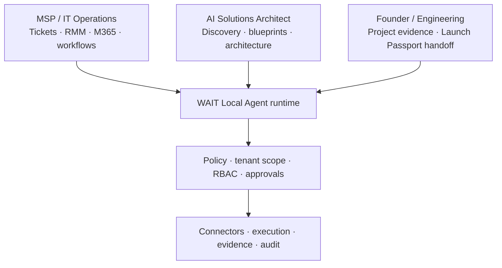
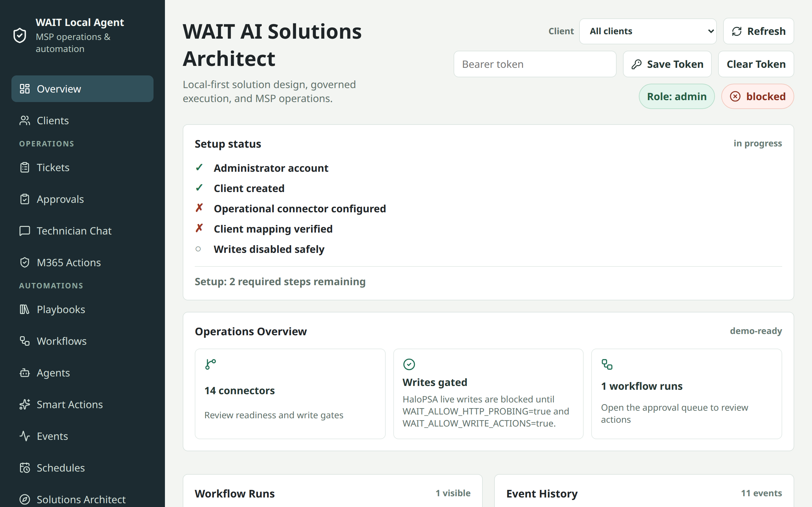
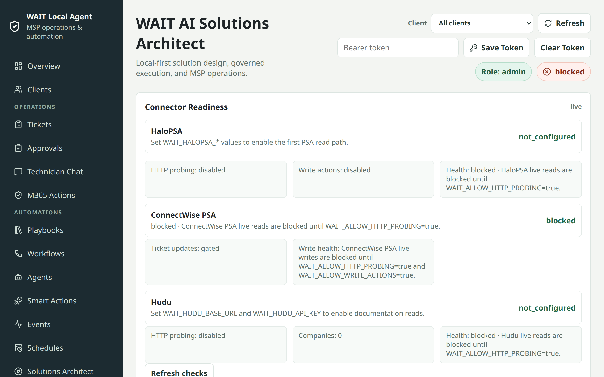
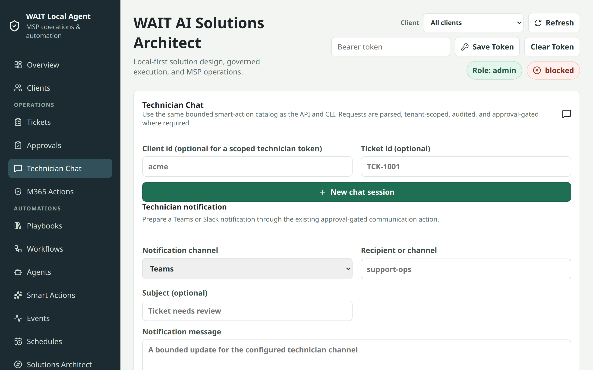
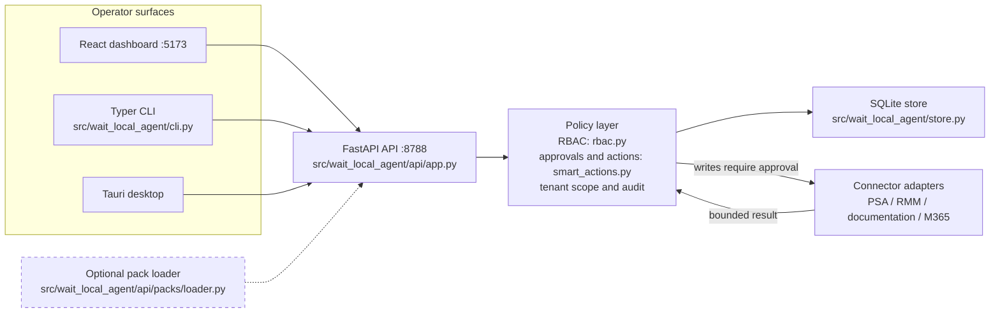
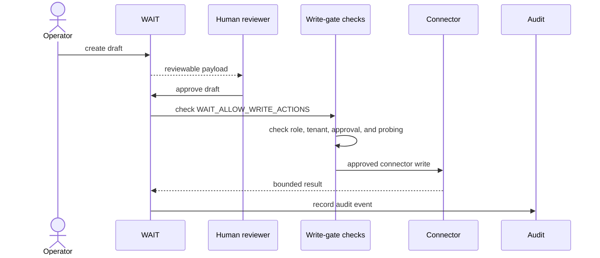
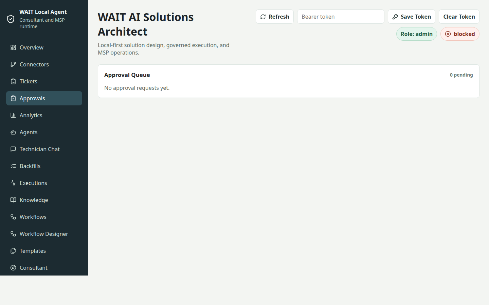

<p align="center">
  
</p>

<h1 align="center">WAIT Local Agent</h1>

<p align="center"><em>Local-first AI execution and change governance for real business systems.</em></p>

<p align="center">
  <a href="https://github.com/W-A-I-T/wait-local-agent/actions/workflows/test.yml"></a>
  <a href="LICENSE"></a>
  <a href="pyproject.toml"></a>
  <a href="CHANGELOG.md"></a>
  <a href="docs/README.md"></a>
</p>

> **Community licensing:** the current `main` development line is licensed as a combined work under **AGPL-3.0-only** together with the applicable WAIT additional terms in [ADDITIONAL_TERMS.md](ADDITIONAL_TERMS.md). Community interactive interfaces containing covered WAIT material must preserve the reasonable visible **Powered by WAIT** attribution. Source published through commit `903cb595e8f735fcc306a68f2bee150fce58a416` remains available under Apache License 2.0 on the preserved `1.x` line. See [LICENSE_HISTORY.md](LICENSE_HISTORY.md).

## What is WAIT Local Agent?

WAIT Local Agent is one local-first, governed AI runtime with **three primary
product streams**: MSP / IT Operations, AI Solutions Architect, and Founder /
Engineering with Launch Passport.

It runs on your own hardware, where your business data and operational
decisions can stay close to you. The streams share the same policy, tenant
scope, RBAC, approval, connector, execution, evidence, and audit boundaries.
AI can help interpret evidence and draft work, while deterministic policy
controls what may happen next. Nothing writes to a live system without
explicit human approval. [Learn the architecture](docs/concepts/architecture.md).

## Three product streams, one governed runtime

WAIT Local Agent is not three unrelated applications. Each stream serves a
different job and audience, but all three reuse the same local runtime and
safety model.

| Stream | Primary users | Typical flow |
| --- | --- | --- |
| **1. MSP / IT Operations** | Internal IT, technicians, MSPs and MSSPs | Ticket or operational signal → local context → triage / plan → bounded action or workflow → approval when required → execution → audit evidence |
| **2. AI Solutions Architect** | Consultants, architects and technical teams | Business problem → guided discovery → provider-neutral blueprint → architecture decision → implementation target → governance / evaluation → delivery handoff |
| **3. Founder / Engineering + Launch Passport** | Founders and engineering teams | Local project → local scan → review the evidence package → explicit upload confirmation → Launch Passport handoff → results |


```mermaid
flowchart TB
  MSP["MSP / IT Operations\nTickets · RMM · M365 · workflows"]
  Architect["AI Solutions Architect\nDiscovery · blueprints · architecture"]
  Founder["Founder / Engineering\nProject evidence · Launch Passport handoff"]

  Runtime["WAIT Local Agent runtime"]
  Guardrails["Policy · tenant scope · RBAC · approvals"]
  Services["Connectors · execution · evidence · audit"]

  MSP --> Runtime
  Architect --> Runtime
  Founder --> Runtime
  Runtime --> Guardrails
  Guardrails --> Services
```

### 1. MSP / IT Operations

Use WAIT as an AI-assisted technician and automation workspace. Start with a
ticket or client-scoped operational task, bring in bounded context from the
configured PSA, RMM, documentation, Microsoft 365, and local knowledge
surfaces, then review a proposed plan before choosing a supported Smart Action,
workflow, playbook, or agent run. Higher-risk mutations remain behind the
shared approval and write gates, and executions leave local audit evidence.

A typical technician path is:

```text
Ticket → Technician Chat → triage / proposed plan → bounded next step
       → approval when required → execution → audit evidence
```

[Follow the five-minute technician quickstart](docs/getting-started/technician-quickstart.md).

### 2. AI Solutions Architect

Use WAIT to turn a business problem into an inspectable technology plan. The
Solutions Architect stream is **provider-neutral**: guided discovery produces
blueprints and architecture decisions first, then maps components to the most
appropriate implementation target, which may include WAIT-native automation,
Microsoft 365 / Power Platform, MCP, PSA, RMM, APIs, or a human process.

```text
Business problem
      ↓
Guided discovery
      ↓
Solution Blueprint
      ↓
Architecture decision
      ↓
WAIT-native | Microsoft | MCP | PSA | RMM | API | human process
      ↓
Governance / evaluation / delivery handoff
```

Microsoft and Power Platform are implementation targets, not the identity of
this stream. Generated source packages and plans remain reviewable artifacts;
they are not automatically evidence of provider import or deployment.

[Explore the Solutions Architect documentation](docs/consultant/README.md).

### 3. Founder / Engineering + Launch Passport

Use the founder workflow to inspect a local project and prepare a controlled
handoff to Launch Passport. The journey scans locally, prepares an evidence
package, shows what would be shared, and requires explicit confirmation before
that reviewed package is uploaded. The current UI states that source files are
not uploaded and environment values are excluded; configuration key names may
be included in the reviewed evidence package.

```text
Local project → local scan → review what will be shared
              → explicit confirmation → Launch Passport → results
```

The Launch Passport connection is optional to the base appliance, and the
founder journey may depend on the separately installed Founder Pack. Without
that connection or pack, the local runtime remains usable for its other
streams. See the [Founder / Engineering roadmap](ROADMAP.md#founder--engineering-vertical)
for the product boundary and direction.

### Why these streams belong together

The shared runtime is the product foundation. An MSP technician, a solutions
architect, and a founder may start from different problems, but each path
needs the same core controls: identity, tenant or client scope, deterministic
policy, approvals, bounded connectors, execution records, evidence, and audit.
Keeping those controls in one runtime avoids creating separate tool engines or
separate safety models for each workflow.

## Who can use WAIT Local Agent?

Community may be used by an employer's internal technician, an independent
consultant, an MSP or MSSP, or an enterprise, including for commercial work,
when the Community license and attribution terms are followed. [Read the
Community and commercial-use guide](docs/legal/community-vs-commercial-use.md).

## Screenshots

| Dashboard | Connectors and governed actions |
| --- | --- |
|  |  |
| Local operations stay visible in one reviewable workspace. | Inspect connector readiness and keep proposed changes behind the approval boundary. |

## Technician ticket-resolution workflow example

Open a ticket, start a client-scoped Technician Chat session, review a bounded
plan, and inspect the resulting execution and audit evidence. [Follow the
five-minute technician quickstart](docs/getting-started/technician-quickstart.md).



*This is a local demo capture of the technician ticket-resolution workflow.*

## Feature highlights

| | |
| --- | --- |
| 🔒 **Local-first**: SQLite, your hardware, and no cloud dependency. [Get started](docs/getting-started/local-demo.md) | ✅ **Approval-gated writes**: review a draft before a live mutation. [See the write gates](docs/concepts/approvals-and-write-gates.md) |
| 🔌 **14 connector entries**: bounded PSA, RMM, documentation, and Microsoft surfaces. [View the matrix](docs/connectors/README.md) | 🧭 **AI Solutions Architect**: provider-neutral discovery, blueprints, architecture, governance, and implementation planning. [Explore the stream](docs/consultant/README.md) |
| 🧾 **Audit trail and evidence export**: preserve what happened and why. [Read the security model](docs/concepts/security-model.md) | 👥 **RBAC and tenant scoping**: keep operator permissions and client boundaries explicit. [Read the security model](docs/concepts/security-model.md) |
| 🖥️ **Desktop app, Docker, and CLI**: choose the local surface that fits your team. [Choose an install path](docs/getting-started/quickstart-docker.md) | 🧩 **Commercial packs**: extend the public runtime with separately licensed capabilities. [Understand editions and packs](docs/concepts/open-core-boundary.md) |

## Architecture

The three product streams share one API and one policy path. Connectors do not
become a second execution engine: policy checks scope, role, approval, and
outbound settings before a provider call, then records a bounded result.


```mermaid
flowchart LR
  subgraph Surfaces[Operator surfaces]
    Dashboard["React dashboard :5173"]
    CLI["Typer CLI\nsrc/wait_local_agent/cli.py"]
    Tauri["Tauri desktop"]
  end

  API["FastAPI API :8788\nsrc/wait_local_agent/api/app.py"]
  Policy["Policy layer\nRBAC: rbac.py\napprovals and actions: smart_actions.py\ntenant scope and audit"]
  Store["SQLite store\nsrc/wait_local_agent/store.py"]
  Connectors["Connector adapters\nPSA / RMM / documentation / M365"]
  Packs["Optional pack loader\nsrc/wait_local_agent/api/packs/loader.py"]

  Dashboard --> API
  CLI --> API
  Tauri --> API
  API --> Policy
  Policy --> Store
  Policy -->|writes require approval| Connectors
  Connectors -->|bounded result| Policy
  Packs -.-> API
  style Packs stroke-dasharray: 5 5
```

### What stays in the local runtime

| Part | Job | Default boundary |
| --- | --- | --- |
| Dashboard and desktop | Give an operator a visible workspace. | Served from the local machine. |
| FastAPI and CLI | Accept bounded requests and expose the same runtime services. | Local API on `127.0.0.1:8788` unless you configure otherwise. |
| SQLite store | Keep tickets, drafts, approvals, runs, knowledge, clients, connector mappings, and audit events. | A local file or Docker volume. |
| Connector adapters | Read approved provider surfaces and carry out allowlisted actions. | No outbound call until probing is enabled. |

The normal path is easy to follow: start with local demo data, examine a
draft, review the policy decision, and only then choose whether a provider
connection should be enabled. A team can keep the runtime offline for
documentation, workflow, and audit work, then configure one connector at a
time as its operating practices mature.

Client identity is kept in a small local directory. Connector instances can
be shared across the MSP or associated with one client, while external
companies are linked to clients only after an operator verifies the mapping.
Records that cannot yet be identified have a quarantine destination, so an
unresolved provider identity is visible for review instead of being silently
assigned.

The core modules are visible in the repository: `api/app.py` serves the API,
`cli.py` exposes the command line, `rbac.py` and `smart_actions.py` enforce
governed operations, and `store.py` persists local state. The desktop bundle
packages the existing dashboard with the local server sidecar.

## How writes are governed

WAIT starts with a local draft that a human can inspect and edit. Approval is
checked together with the operator role, tenant scope, connector readiness,
and explicit outbound settings. A live mutation also requires
`WAIT_ALLOW_WRITE_ACTIONS=true`; this flag is off by default. Successful and
blocked attempts become local audit events, and provider failures remain
failures rather than being presented as success.


```mermaid
sequenceDiagram
  actor Operator
  participant WAIT
  participant Human as Human reviewer
  participant Gate as Write-gate checks
  participant Connector
  participant Audit

  Operator->>WAIT: create draft
  WAIT-->>Human: reviewable payload
  Human->>WAIT: approve draft
  WAIT->>Gate: check WAIT_ALLOW_WRITE_ACTIONS
  Gate->>Gate: check role, tenant, approval, and probing
  Gate->>Connector: approved connector write
  Connector-->>WAIT: bounded result
  WAIT->>Audit: record audit event
```



*The approval queue is the point where a proposed change becomes eligible for
execution; the image is a local demo capture.*

The gate is deliberately repeated at execution time. Editing a draft does not
grant permission, an approval from another tenant cannot be reused, and a
provider response is not treated as evidence of success until the connector
returns a bounded result. This gives reviewers a clear local record even when
an external system is unavailable or rejects the request.

## Quickstart

### Production (image, recommended for MSP operation)

The published production appliance serves the compiled dashboard and API from
one versioned image. It is the recommended MSP path and requires Linux, Docker,
and Compose v2, but no Git or Node.js.

```bash
curl -fsSL https://raw.githubusercontent.com/W-A-I-T/wait-local-agent/main/scripts/install.sh \
  | bash -s -- --version stable
```

See the [production installation guide](docs/getting-started/production-install.md).

### Development (source and Vite, contributors)

```bash
git clone https://github.com/W-A-I-T/wait-local-agent.git
cd wait-local-agent
cp .env.example .env
# Choose one explicit mode before starting:
# printf '\nWAIT_DEMO_MODE=true\n' >> .env
# or set WAIT_ADMIN_TOKEN to a strong local token and keep demo mode false.
docker compose up --build
```

- Dashboard: `http://127.0.0.1:5173`
- API: `http://127.0.0.1:8788`
- The dashboard is a Vite development server that proxies API traffic to the API container.
- Persistent SQLite state lives in the `wait-local-agent-data` Docker volume.
- The shipped `.env.example` keeps demo mode off. Set `WAIT_DEMO_MODE=true`
  explicitly for the bounded local walkthrough, or configure an admin token.
- Linux collectors are container-scoped by default. Host collection is an explicit, security-sensitive opt-in; see [host-collection.md](docs/operations/host-collection.md).

### Desktop (non-MSP surface)

Download the installer for your operating system from [GitHub
Releases](https://github.com/W-A-I-T/wait-local-agent/releases). The desktop
bundle runs the dashboard with a local server sidecar for individual local use;
it is not the MSP production appliance. [Full guide
→](docs/getting-started/desktop-install.md)

### CLI

```bash
python3 -m venv .venv
source .venv/bin/activate
python -m pip install -e ".[dev]"
wait-local-agent serve
```

For the deterministic, credential-free walkthrough, run
`scripts/demo_appliance.sh` as described in the [Full guide
→](docs/getting-started/local-demo.md).

The CLI and Docker paths use the same local data model. You can start with the
demo, inspect the API and dashboard, and then move to a configured install
without creating a second runtime or migrating your workflow definitions.

### Operator authentication boundary

`WAIT_DEMO_MODE` defaults to `false`. A non-demo appliance fails to start
unless it has `WAIT_ADMIN_TOKEN`, `WAIT_API_TOKEN`, or an active persisted
`msp_admin` principal credential. Explicit demo mode is bounded to the demo
client: provider writes and deployments are disabled, and `/secrets` returns
HTTP 403.

The identity model supports principals with roles assigned per client and a
global `msp_admin` role for cross-client administration. Principal credentials
are stored as SHA-256 hashes; raw credentials are not persisted.
Cloud inventory connectors are governed read-only adapters for AWS, Azure,
GCP, and Microsoft 365. They require a vault credential reference and never
persist credential material. See the provider-specific permission guides.

## Connectors

The matrix below lists the connector IDs currently returned by the runtime’s
14 `ConnectorStatus` entries. “Yes” means the connector exposes an
approval-gated write surface; “No” means the documented surface is read-only.
All outbound calls still require explicit probing, and every mutation keeps
the write flag and applicable approval checks.

| ID | Connector | Read surface | Approval-gated writes |
| --- | --- | --- | --- |
| `halopsa` | HaloPSA | tickets, notes, clients, assets | Yes |
| `hudu` | Hudu | companies, articles, folders | No |
| `itglue` | IT Glue | organizations, documents, folders | No |
| `confluence` | Confluence Cloud | bounded pages | No |
| `notion` | Notion | mapped pages and data sources | Yes |
| `sharepoint` | SharePoint | sites and document metadata | No |
| `connectwise` | ConnectWise PSA | tickets and companies | Yes |
| `syncro` | Syncro | tickets, comments, customers | Yes |
| `servicenow` | ServiceNow | incidents and companies | Yes |
| `autotask` | Autotask PSA | tickets and companies | Yes |
| `m365` | Microsoft 365 / Entra | users, groups, mail, devices | Yes |
| `timezest` | TimeZest | mapped scheduling requests | Yes |
| `scalepad` | ScalePad | mapped risk and compliance reads | No |
| `rmm` | Configured RMM adapter | bounded NinjaOne, Datto, N-central, N-sight, Kaseya, or ScreenConnect surfaces | Yes |

[See the full connector matrix, setup pages, and fixture/live evidence](docs/connectors/README.md).

Connector rows describe the public contract, not a promise that a provider is
reachable from your network. The matrix marks fixture coverage separately from
live verification, and setup pages explain the credentials and tenant maps
that must be configured locally. Power Platform output follows the same rule:
it is an inspectable source package for a later local operation, not proof of
import or deployment.

## Editions

| Edition | What it means |
| --- | --- |
| **Community** | **C$0 · AGPL-3.0-only + applicable WAIT Section 7 terms · this public repository · self-hosted · commercially usable when the Community terms are followed · Powered by WAIT attribution retained** |
| **Professional** | Separate commercial licensing, official packaging, support, and services for teams that need contractual commercial rights or operational assistance. |
| **MSP** | Commercial rights and services for managed-service operation, including separately licensed packs/control-plane capabilities where purchased. |
| **Enterprise** | Commercial licensing, integration, assurance, support, and enterprise capabilities under contract. |

Community can be used commercially, including by MSPs that follow the AGPL and
WAIT attribution terms; commercial MSP offerings add separately licensed
control, packs, reporting, and services. [Compare the two
routes](docs/legal/community-vs-commercial-use.md).

Community remains a real route: AGPL-3.0-only permits commercial use subject to its conditions, including the network-source obligations applicable to modified versions, and the applicable WAIT Section 7 terms require the `Powered by WAIT` attribution for covered WAIT material in interactive interfaces. Commercial agreements can separately provide private-modification rights, proprietary WAIT packs, managed-service terms, official builds, support, attribution removal, partner/co-branding, white-labeling, or OEM rights where explicitly contracted. See [ADDITIONAL_TERMS.md](ADDITIONAL_TERMS.md), [LICENSE_HISTORY.md](LICENSE_HISTORY.md), and [the public/commercial boundary](docs/concepts/open-core-boundary.md).

## Documentation

- [Getting started](docs/README.md#getting-started): Docker, CLI, desktop, demo, and configuration.
- [Architecture](docs/concepts/architecture.md): runtime layers and provider-neutral design.
- [Approvals and write gates](docs/concepts/approvals-and-write-gates.md): draft, review, approval, execution, and audit.
- [Security model](docs/concepts/security-model.md): safe defaults, tenancy, redaction, and threat boundaries.
- [Connector matrix](docs/connectors/README.md): IDs, read surfaces, writes, and evidence limits.
- [Solutions Architect](docs/consultant/README.md): discovery, blueprints, architecture, governance, and Microsoft targets.
- [Founder / Engineering roadmap](ROADMAP.md#founder--engineering-vertical): project inspection, evidence collection, and Launch Passport handoff.
- [Operations](docs/README.md#operations): backups, scheduling, updates, host collection, and packs.
- [Reference](docs/README.md#development-and-reference): API, CLI, environment variables, and MCP boundaries.

## Audit, diagnostics, and privacy

- Audit records stay in the customer's local database and files.
- WAIT does not see customer activity by default.
- Commercial entitlement metering is a separate commercial-pack system, not a
  feature of the public runtime.
- Support uploads require explicit customer action; the planned flow includes
  preview and local download before any optional upload.

[Read the telemetry and license-metering boundary](docs/privacy/telemetry-and-license-metering.md).

## Safety defaults

> Safety default: fresh installs are read-first and local-first. Live connector writes require `WAIT_ALLOW_WRITE_ACTIONS=true`, outbound connector connection checks must be explicitly enabled, and HaloPSA writes still require an approved draft.

These defaults are part of the product boundary, not a substitute for testing
your own provider configuration. Non-demo startup also requires an admin
credential as described above. Generated Power Platform output is a
credential-free source package for a later local operation; it is not provider
import, live verification, or deployment evidence.

For a shared installation, add bearer-token roles and a Fernet vault, keep
connector credentials out of action payloads, and review the [configuration
guide](docs/getting-started/configuration.md) before enabling network access.
The [security model](docs/concepts/security-model.md) explains the threat
boundaries, redaction behavior, and tenant-scoped audit trail in more detail.

## Community and contributing

- Read [CONTRIBUTING.md](CONTRIBUTING.md) before proposing a change.
- Follow the [Code of Conduct](CODE_OF_CONDUCT.md).
- Ask questions and share local patterns in [GitHub Discussions](https://github.com/W-A-I-T/wait-local-agent/discussions).
- Report security issues through [SECURITY.md](SECURITY.md), not a public issue.

## License

The WAIT Local Agent **2.0 development line** is distributed as a combined work under **GNU Affero General Public License v3 only (`AGPL-3.0-only`)** together with the applicable WAIT additional terms in [ADDITIONAL_TERMS.md](ADDITIONAL_TERMS.md). Community interactive interfaces containing covered WAIT material must preserve the reasonable visible **Powered by WAIT** attribution. See [LICENSE](LICENSE) and [NOTICE](NOTICE).

Source published through `903cb595e8f735fcc306a68f2bee150fce58a416` remains available under Apache License 2.0 on the preserved `1.x` line. See [LICENSE_HISTORY.md](LICENSE_HISTORY.md) for the version boundary and [COMMERCIAL_LICENSE.md](COMMERCIAL_LICENSE.md) for the separate commercial-licensing path, including explicit branding-removal, white-label, and OEM rights where contracted.
