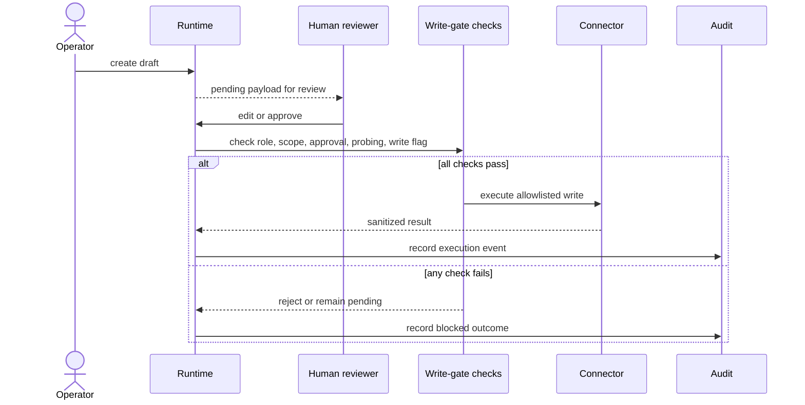

# Approvals and Write Gates

WAIT Local Agent creates a local draft before a governed connector mutation.
The draft payload is reviewable and editable while pending. A technician or
admin approves it; execution then checks the approval state, role, tenant
scope, connector readiness, outbound probing flag, and write flag before the
provider call. The result is sanitized into the local execution and audit
history.

`src/wait_local_agent/rbac.py` defines the role ordering: viewer, technician,
and admin (with a separate end-user role). `src/wait_local_agent/config.py`
defines `WAIT_ALLOW_HTTP_PROBING` and `WAIT_ALLOW_WRITE_ACTIONS`; both default
to disabled. `Store.create_approval_request`, approval update/edit methods,
and `SmartActionService` provide the persisted review and execution boundary.

Provider response bodies, credentials, and raw bearer tokens are not intended
for approval or audit payloads. An approved action can still fail at the
provider; the runtime records that failure rather than reporting success.

