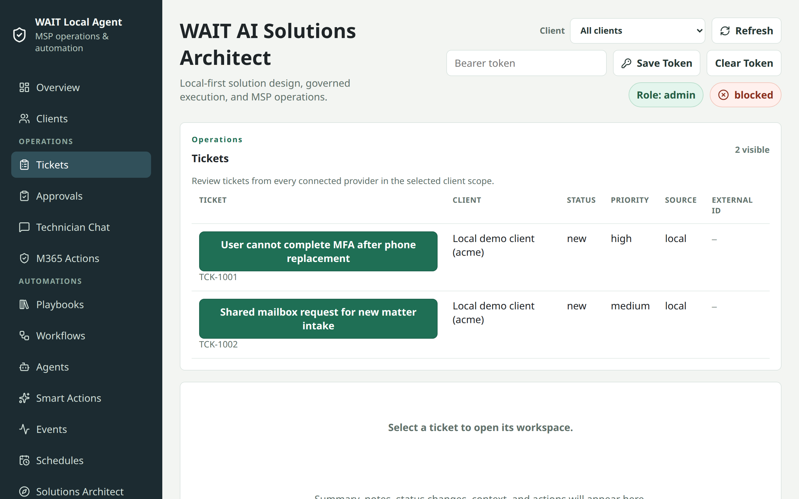

# Technician Ticket-Resolution Quickstart

Use this five-minute path to take one ticket from initial review to local
evidence. The exact action choices depend on the connected provider and your
assigned client access.

## 1. Open the ticket

Open **Tickets**, choose the client, and select the ticket you intend to work.
Confirm the requester, current status, and recent activity before proposing a
change.

*The Tickets screen provides the starting context for the technician workflow.*

## 2. Start a scoped chat session

Open **Technician Chat** and create a session for the same client. Attach the
ticket when you want the conversation tied to that record; a session may also
remain client-scoped without a ticket.

*This is a local demo capture of a technician reviewing one ticket.*

## 3. Ask for triage and a proposed plan

Describe the symptom and ask for a triage summary or a proposed plan. Keep the
request narrow: identify the affected ticket, the desired outcome, and any
limits the plan must respect.

## 4. Review the plan

Check the proposed steps, client and ticket scope, evidence, and intended
outcome. A plan is a review surface, not permission to change a connected
system. Revise or reject it when its scope is unclear.

## 5. Choose a bounded next step

When the plan is acceptable, you may run an available bounded Smart Action or
a deterministic ticket workflow. The catalog describes the supported action
and its limits. Read-only and preview steps can be useful even when provider
writes remain disabled.

Higher-risk changes move to **Approvals**. A reviewer must approve the draft
before it is eligible to run. A live write also requires
`WAIT_ALLOW_WRITE_ACTIONS=true`, which is off by default, and the runtime
rechecks role, client, scope, and connector support at execution time.

## 6. Inspect the evidence

Open **Executions** to see the run, step status, and bounded error details. Open
**Audit** to review the recorded decision and outcome. Keep both views with the
ticket when documenting what was attempted and what actually happened.

## What it does NOT do yet

- It does not merge duplicate tickets automatically.
- It does not promise automatic closure for every ticket or workflow.
- It does not assume every connector can write; support varies by provider and
  action.
- It does not bypass the write flag, approved draft, role, client, or scope
  checks.
- The optional end-user support surface is disabled by default. When enabled,
  it uses a separate fixed requester identity with no technician or
  administrator privileges.

