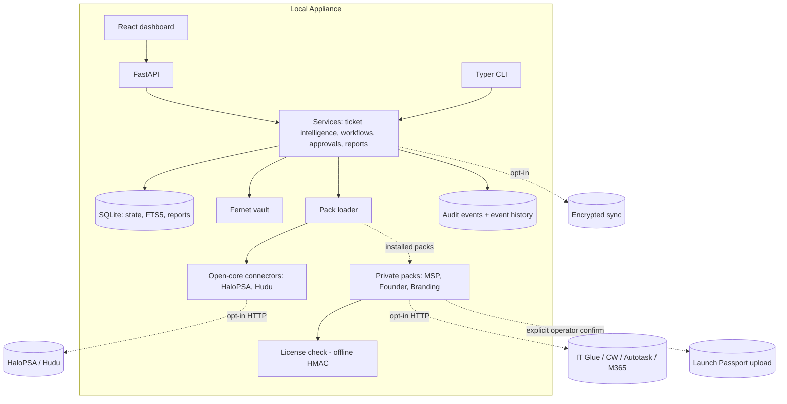

# WAIT Local Agent — Commercial Build Report

Status: PR 1 implemented and validated. Report produced from direct repo inspection, not from README claims.

Date: 2026-07-01
Branch: `feat/report-framework`
Scope: `W-A-I-T/wait-local-agent` (public, Apache-2.0 open core) and `W-A-I-T/wait-local-agent-packs` (private, paid packs).

---

## 1. Executive Summary

**What exists now (verified in source, not docs):**

- A working local-first appliance core: FastAPI operator API (~38 routes), Typer CLI (10 command groups), React/Vite dashboard, SQLite store with FTS5 knowledge search, deterministic ticket intelligence, approval engine with a full draft → edit → approve → execute → audit lifecycle, HaloPSA read + approval-gated write, Hudu read-only, Fernet secrets vault, backup/restore, and JSON/CSV audit export.
- Safe defaults are enforced in code (`config.py`): writes, HTTP probing, cloud fallback, model inference, and OCR all default to off and require explicit environment opt-in.
- CI runs ruff, mypy, bandit, pip-audit, pytest with a 95% coverage floor, a public-surface term audit, and UI tests/build. All checks pass on this branch.

**What is commercially usable now:** the open-core appliance as a read-mostly HaloPSA/Hudu copilot with approval-gated HaloPSA writes. It is honest about its own limits: no RBAC, no tenant boundaries, no rate limiting, no pack system, no paid reports.

**What is missing for commercial launch:** the report framework (added in PR 1 of this plan), report-first connector health and audit surfaces, a pack loader boundary, the private MSP/Founder packs, licensing, branding, sync, RBAC, rate limiting, and tenant boundaries.

**What should be built first:** the generic report framework (done, this branch), then report-first connector health and audit export, then the pack loader interface — because every paid feature is a report provider or connector provider plugging into those three pieces.

**Repo placement:** all framework, interfaces, open-core connectors, and safety machinery stay in `wait-local-agent`. All paid connector internals, QBR/Founder report logic, licensing, branding, and sync stay in `wait-local-agent-packs`. Section 3 has the full table.

**Access limitation:** the private packs repo could not be cloned from this build environment (no GitHub credentials available). Everything in this report about the packs repo internals is design intent derived from the public repo's documented boundary, and is explicitly marked **UNVERIFIED** until the repo is inspected directly.

---

## 2. Repo Truth Audit

### 2.1 `W-A-I-T/wait-local-agent` (public) — inspected directly

**Files inspected:** `README.md`, all 15 files under `docs/`, `pyproject.toml`, `uv.lock`, every module under `src/wait_local_agent/` (20 modules, ~7,800 lines), `ui/src/App.tsx` (680 lines) and UI tests, all 15 test modules, `.github/workflows/test.yml`, `docker-compose.yml`, `Dockerfile`, `.env.example`, and all six scripts under `scripts/`.

**Actual architecture (as built, not as described):**

- `config.py` — frozen `Settings` dataclass from environment variables; every dangerous capability behind a `WAIT_ALLOW_*` boolean defaulting to false; optional Fernet vault as secrets backend with env fallback.
- `store.py` — single `Store` class over `sqlite3`; schema created idempotently with `create table if not exists` plus `_ensure_column` additive migration helper; tables before this branch: `tickets`, `approvals`, `audit_events`, `approval_requests`, `event_history`, `workflow_runs`, `knowledge_documents`, `knowledge_chunks`, `knowledge_chunks_fts` (FTS5).
- `models.py` — frozen dataclasses and `Literal` status types; ISO-8601 UTC strings for timestamps via `utc_now()`.
- `api/app.py` — `create_app(settings)` factory; app-level bearer-token dependency (`security.py`, constant-time compare, enforced outside demo mode); payload redaction helper for approval views.
- `cli.py` — one Typer root app with sub-apps: tickets, audit, knowledge, connectors, workflows, approvals, events, backup, secrets (and now reports).
- `halopsa.py` / `hudu.py` — httpx clients; every read gated on `allow_http_probing`; every HaloPSA write gated on `allow_write_actions` **and** an approved approval request; drafts stored as approval requests with previewable payloads.
- `workflows.py` — five static templates; approval-required templates create approval requests instead of acting.
- `vault.py` — Fernet key + encrypted JSON file, `0700`/`0600` permissions.
- `providers.py` — deterministic provider by default; optional OpenAI-compatible local endpoint only when inference is enabled.
- `scripts/public_surface_audit.py` — blocks a fixed set of terms from every tracked text file; this report is written to comply with it.

**Working capabilities confirmed by running the test suite:** all of the above have passing tests; baseline coverage on `main` was 95.29%.

**Validation commands (actual, from CI and `scripts/validate_release.sh`):** `ruff check .`, `mypy src tests`, `bandit -r src`, `pip-audit --skip-editable`, `pytest --cov=wait_local_agent --cov-fail-under=95`, `python scripts/public_surface_audit.py`, `cd ui && npm ci && npm run test && npm run build`. All exist as documented — no missing-command substitutions were needed.

**Blockers found:**

1. `cryptography>=42,<47` pinned a version with a known advisory (GHSA-537c-gmf6-5ccf); `pip-audit` fails on a clean install. Fixed in this branch by widening to `<49` (48.0.7 installs cleanly, all tests pass).
2. Coverage floor headroom was thin (95.29% vs 95.00%); any lightly tested addition breaks CI. New report code is at 98–100% coverage and raised the total to 95.74%.

**Stale docs / inaccurate claims:** none material. `docs/status.md` matches the code unusually well, including its own "not ready" list. The README's safety claims are enforced in `config.py` rather than merely asserted. One nuance: `docker-compose.yml` runs in demo mode with auth off by default, which is correct for demo but must be called out in hardening docs as unsuitable for exposed deployments.

**Risks:** single shared SQLite connection pattern per call (fine locally, needs review before any multi-worker deployment); no rate limiting; bearer token is a single shared secret with no roles; `packs/` install path exists only as a gitignore entry — no loader yet.

### 2.2 `W-A-I-T/wait-local-agent-packs` (private) — **ACCESS BLOCKED**

`git clone` over HTTPS failed with an authentication prompt: this build environment holds no GitHub credentials for private repos. Consequences:

- The truth audit for this repo **cannot be completed here**. `README.md`, `AGENTS.md`, existing directory layout, and any pack loader expectations already encoded there are unknown to this report.
- All private-pack design in Sections 3, 5, 7, 9, and 10 is derived from the public repo's `docs/open-core-boundary.md`, `docs/commercial-model.md`, and the stated target structure, and is marked **UNVERIFIED**.
- Required follow-up: run the same inspection pass inside an environment with repo credentials before starting PR 4, and reconcile this report against the actual pack repo contents. The protected paths `packs/license/` and `packs/founder/lp_client.py` were not and will not be touched without explicit human approval.

---

## 3. Open-Core Boundary Report

| Capability | Public repo? | Private packs repo? | Reason | Files |
| ---------- | -----------: | ------------------: | ------ | ----- |
| FastAPI API | Yes | No | Core runtime, Apache-2.0 | `src/wait_local_agent/api/app.py` |
| CLI | Yes | No | Core runtime | `src/wait_local_agent/cli.py` |
| SQLite store | Yes | No | Core state layer | `src/wait_local_agent/store.py` |
| Approval engine | Yes | No | Safety machinery must be inspectable | `store.py`, `connectors.py`, `api/app.py` |
| Report framework (models, renderers, storage, routes) | Yes | No | Shared substrate for free and paid reports | `src/wait_local_agent/reports/` |
| HaloPSA open-core connector | Yes | No | Existing open surface | `src/wait_local_agent/halopsa.py` |
| Hudu open-core connector | Yes | No | Existing open surface | `src/wait_local_agent/hudu.py` |
| Pack loader (interfaces, discovery, validation) | Yes | No | Boundary contract must be public | planned `src/wait_local_agent/packs/` (PR 3) |
| RBAC | Yes | No | Security must not be paywalled | planned (PR 10) |
| Audit export | Yes | No | Trust feature | `api/app.py`, `cli.py` |
| Rate limiting | Yes | No | Security hardening | planned (PR 10) |
| IT Glue connector | No | Yes | Paid MSP surface | `packs/msp/` (UNVERIFIED) |
| ConnectWise connector | No | Yes | Paid MSP surface | `packs/msp/` (UNVERIFIED) |
| Autotask connector | No | Yes | Paid MSP surface | `packs/msp/` (UNVERIFIED) |
| RMM connectors (NinjaOne/Datto/N-able/Kaseya) | No | Yes | Paid, read-only stubs first | `packs/msp/` (UNVERIFIED) |
| M365/Entra read-only connector | No | Yes | Paid MSP surface | `packs/msp/` (UNVERIFIED) |
| QBR reports | No | Yes | Paid report provider | `packs/msp/reports/qbr.py` (UNVERIFIED) |
| Automation opportunity / ROI report | No | Yes | Paid report provider | `packs/msp/reports/` (UNVERIFIED) |
| Founder scanner | No | Yes | Paid Founder surface | `packs/founder/` (UNVERIFIED) |
| Evidence vault | No | Yes | Paid Founder surface | `packs/founder/` (UNVERIFIED) |
| LP CollectorBundle export | No | Yes | Paid; upload path is human-approval-gated | `packs/founder/` (PROTECTED: `lp_client.py`) |
| License gate | Interface stub only | Implementation | Enforcement internals stay private | public `PackLicenseStatus`; `packs/license/` (PROTECTED) |
| Branding / white-label | No | Yes | Paid | `packs/branding/` (UNVERIFIED) |
| Sync (backup/template/entitlement) | No | Yes | Paid, opt-in cloud path | `sync/` (UNVERIFIED) |
| Template marketplace | Open schema + open templates public; premium templates private | Premium templates | Schema public, content split | `workflows.py` public; `packs/msp/` private |

Hard rules restated: no MSP/Founder pack internals, no license enforcement internals, no private RMM/M365 code, no white-label implementation, no proprietary templates, and no AGPL-derived code may land in the public repo. `packs/` in the public repo stays gitignored as the local install target.

---

## 4. Target Architecture

Local appliance, one host, no cloud dependency by default.



Every arrow crossing the appliance boundary is opt-in, credentialed, and audited. The pack loader is the only seam between open core and paid code: packs register report providers, connector providers, and workflow providers against public interfaces; a missing or unlicensed pack degrades to a visible "not installed / not licensed" status, never an error path that weakens the core.

---

## 5. Report-First Product Model

Everything the product does should end in a stored, exportable report. All twelve types are registered in the shipped `ReportType` enum (PR 1) so IDs are stable before providers exist.

Shared plumbing for every type (shipped in PR 1): storage in the `reports` table; JSON schema in `reports/schemas.py`; JSON and Markdown renderers with mandatory secret redaction; `GET /reports`, `GET /reports/{id}`, `GET /reports/{id}/export`; `wait-local-agent reports list|show|export`; audit events `report.created` and `report.exported`; PDF rendering deferred (enum value reserved, renderer raises a clear error, covered by tests).

| # | Report type | Purpose | User | Inputs | Producer & repo |
|---|---|---|---|---|---|
| 1 | `ticket_intelligence` | Classification, summary, cited response draft per ticket | MSP technician | tickets, knowledge chunks | public (PR 2 wraps existing service) |
| 2 | `approval_execution` | What was approved, by whom, what executed, result | MSP lead / auditor | approval_requests, event_history | public (PR 2) |
| 3 | `connector_health` | Per-connector configured/ready/blocked status + probe results | Operator | connector statuses, opt-in probes | public (PR 2) |
| 4 | `audit_export` | Full audit trail snapshot as a signed-off artifact | Auditor / client | audit_events | public (PR 2) |
| 5 | `qbr` | Quarterly business review per client | MSP account manager | tickets, workflow runs, audit data | private `packs/msp` (PR 5, UNVERIFIED) |
| 6 | `automation_opportunity` | Time-saved / ROI and candidate automations | MSP owner | workflow runs, ticket patterns | private `packs/msp` (UNVERIFIED) |
| 7 | `founder_preflight` | Launch-readiness scan of a founder project | Founder | project scanner output | private `packs/founder` (PR 7, UNVERIFIED) |
| 8 | `developer_handoff` | Structured handoff document for contractors | Founder | scanner + evidence manifest | private `packs/founder` (PR 7, UNVERIFIED) |
| 9 | `collector_bundle` | Signed, hashed, redacted LP evidence bundle manifest | Founder | evidence vault | private `packs/founder` (PR 8; upload path PROTECTED) |
| 10 | `investor_evidence` | Investor-facing evidence preparation | Founder | bundles, preflight reports | private `packs/founder` (UNVERIFIED) |
| 11 | `license_entitlement` | Installed packs, entitlements, license state | Operator | pack registry, license state | public stub route; private enforcement (PROTECTED) |
| 12 | `appliance_hardening` | Config posture: auth, flags, vault, backups | Operator | Settings, vault state | public (PR 10) |

Outputs for all: JSON (canonical) + Markdown, stored under the report ID; PDF later. UI: a Report Center page (PR 9) with list, filters, detail, and export buttons.

---

## 6. Data Model / SQLite Schema Plan

Existing tables were inspected first (Section 2.1 list). The store uses idempotent DDL plus an additive `_ensure_column` helper — no migration framework. All proposals below follow that pattern; nothing breaks existing data.

**Added in PR 1 (shipped):**

```sql
create table if not exists reports (
    id text primary key,
    report_type text not null,
    title text not null,
    created_at text not null,
    created_by text not null default '',
    client_id text not null default '',
    project_id text not null default '',
    sections_json text not null,
    metadata_json text not null default '{}'
);
```

**Planned additive tables (public repo, PRs 2–10):** `clients` (id, name, external_refs_json), `roles` and `api_tokens` (token hash, role, label — replaces single shared token), `connector_accounts` (connector id, client scope, vault key refs — never raw secrets), `connector_health_checks` (connector, status, message, checked_at), `report_jobs` (report_type, params_json, status, report_id), `pack_registry` (pack id, version, capabilities_json, status), `pack_entitlements` (pack id, entitlement, source), `license_state` (opaque status only — verification stays in the private pack).

**Planned private-pack tables (UNVERIFIED until packs repo inspection; created via the same additive pattern, namespaced `founder_*` / `msp_*`):** `founder_projects`, `evidence_bundles`, `bundle_files` (path, sha256, redaction flags, manifest entry), `qbr_snapshots`.

Rules: TEXT ISO-8601 timestamps everywhere (matches `utc_now()`); JSON columns for nested payloads; no destructive `alter`; every new column via `_ensure_column` with a default.

---

## 7. API Design

Conventions (all verified against the existing app): routes live in `create_app`, bearer auth applies app-wide outside demo mode, errors map `KeyError→404`, `PermissionError→409`, `ValueError→400`, state changes write audit events.

**Shipped in PR 1 (public core):**

| Method | Path | Auth | Request | Response | Side effects / audit |
|---|---|---|---|---|---|
| GET | `/reports` | bearer (non-demo) | query: `report_type`, `client_id`, `project_id` | list of redacted report objects | none |
| GET | `/reports/{id}` | bearer | — | redacted report object; 404 if missing | none |
| GET | `/reports/{id}/export` | bearer | query: `export_format` = json\|markdown | file attachment | audit `report.exported` |

**Planned public routes:** `POST /reports/connector-health` (runs checks, stores report — PR 2), `GET /audit/report` (stores an `audit_export` report then returns it — PR 2), `GET /packs` (registry list — PR 3), `GET /license/status` (stub returning open-core status — PR 3), `GET /auth/session` (role/session status — PR 10), `GET /onboarding/status` (setup checklist — PR 9/10).

**Planned private-pack routes (mounted by the loader only when the pack is installed and licensed; all UNVERIFIED):** `POST /packs/msp/reports/qbr`, `POST /packs/msp/reports/automation-opportunity`, `POST /packs/founder/reports/preflight`, `POST /packs/founder/reports/handoff`, `POST /packs/founder/bundles` + `POST /packs/founder/bundles/{id}/validate` + `GET /packs/founder/bundles/{id}/export` (build/validate/export only — **no upload route without explicit human approval**), `GET/PUT /packs/branding/config`, `GET /sync/status`. Each requires a validated request model, writes an audit event, and ships with tests in the packs repo.

---

## 8. CLI Design

Existing pattern: one Typer sub-app per domain, k=v output lines, exit code 1 with a plain message on failure. Every state-changing command writes an audit event (report export does; list/show do not change state).

**Shipped in PR 1:**

```text
wait-local-agent reports list [--report-type T] [--client-id C] [--project-id P]
wait-local-agent reports show REPORT_ID
wait-local-agent reports export REPORT_ID [--export-format json|markdown] [--output PATH]
```

Code location: `src/wait_local_agent/cli.py` (`reports_app`).

**Planned groups:** `connectors validate` (scoped credential checks, PR 2/10); `packs list|verify` (PR 3); `license status|install` (stub public, enforcement private, PR 3+); `founder scan|preflight|handoff|bundle build|bundle validate|bundle export` (private pack commands registered through the loader, PR 6–8, UNVERIFIED); `qbr generate` (private, PR 5); `audit report` (stores an audit_export report, PR 2); `backup create --encrypt` (PR 10). Existing `audit`/`backup` groups remain untouched.

---

## 9. Pack Loader / Plugin Architecture

Public repo defines the contract (PR 3); private repo implements it. Proposed public interface, matching repo dataclass style:

```python
# src/wait_local_agent/packs/interface.py  (PR 3)
from __future__ import annotations
from dataclasses import dataclass, field
from typing import Protocol
from wait_local_agent.reports.models import GeneratedReport, ReportType


@dataclass(frozen=True)
class PackCapability:
    kind: str          # "report" | "connector" | "workflow"
    identifier: str    # e.g. "qbr", "itglue"


@dataclass(frozen=True)
class PackManifest:
    pack_id: str
    name: str
    version: str
    capabilities: tuple[PackCapability, ...] = ()
    requires_license: bool = True


@dataclass(frozen=True)
class PackLicenseStatus:
    pack_id: str
    licensed: bool
    message: str = ""
    entitlements: tuple[str, ...] = field(default_factory=tuple)


class PackReportProvider(Protocol):
    report_type: ReportType
    def generate(self, params: dict[str, object]) -> GeneratedReport: ...


class PackConnectorProvider(Protocol):
    connector_id: str
    def health(self) -> dict[str, object]: ...


class PackWorkflowProvider(Protocol):
    template_ids: tuple[str, ...]
```

Loader behavior (public): discover packs under the gitignored `packs/` install directory via `manifest.json`; validate manifests against the schema; import provider entry points inside a try/except so a broken or missing pack yields a `pack_registry` row with status `failed`/`missing` and never crashes the core; expose everything read-only via `GET /packs` and `wait-local-agent packs list`. License checks are delegated: the public loader only records the `PackLicenseStatus` a pack reports; verification internals live in `packs/license/` (PROTECTED, private).

Private repo implements MSP/Founder/Branding/Sync manifests and providers against these types, with its own tests (UNVERIFIED until that repo is inspected).

---

## 10. Code Implementation Plan (PR sequence)

Small PRs, each independently shippable. Rollback for every public PR: revert the merge commit; all schema changes are additive so a revert leaves harmless empty tables.

| PR | Repo | Branch | Objective | Definition of done |
|---|---|---|---|---|
| 1 | wait-local-agent | `feat/report-framework` | Generic report model, storage, renderers, API, CLI (this branch) | full validation suite green — **DONE, see §11** |
| 2 | wait-local-agent | `feat/report-first-health-audit` | Connector health + audit export become stored reports; `connectors validate` CLI | new routes/commands tested; reports appear in `/reports` |
| 3 | wait-local-agent | `feat/pack-loader` | Interfaces from §9, discovery, `GET /packs`, license status stub | broken/missing pack degrades safely, tested |
| 4 | wait-local-agent-packs | `feat/msp-pack-skeleton` | MSP manifest, IT Glue read-only stub, QBR skeleton | loader discovers pack locally; read-only enforced |
| 5 | wait-local-agent-packs | `feat/qbr-report` | QBR JSON/Markdown from ticket/audit/workflow data | QBR stored via public framework, tested |
| 6 | wait-local-agent-packs | `feat/founder-pack-skeleton` | Founder manifest, project scanner, evidence manifest, preflight shell | **no changes to `lp_client.py`** |
| 7 | wait-local-agent-packs | `feat/founder-reports` | Founder Preflight + Developer Handoff reports | both stored via framework, tested |
| 8 | wait-local-agent-packs | `feat/collector-bundle` | Signed/hashed/redacted bundle build + validate + diff preview | **no upload client without human approval** |
| 9 | wait-local-agent | `feat/ui-report-center` | Dashboard pages: reports, detail, export, pack status, connector health | UI tests + build green |
| 10 | wait-local-agent | `feat/commercial-hardening` | RBAC, rate limiting, tenant boundaries, encrypted backup, update channel design | hardening report type produced by the appliance itself |

Risks per private PR (4–8): the packs repo layout is UNVERIFIED; the first action of PR 4 must be the deferred truth audit of that repo, and this table must be reconciled against `AGENTS.md` there.

---

## 11. PR 1 — Actual Implementation Record

**Files added:**

- `src/wait_local_agent/reports/__init__.py` — package exports
- `src/wait_local_agent/reports/models.py` — `ReportType` (12 values), `ReportFormat`, `ReportSection`, `GeneratedReport` (frozen dataclasses, ISO timestamps via `utc_now()`), JSON section round-trip helpers
- `src/wait_local_agent/reports/renderers.py` — JSON + Markdown renderers; every render passes through recursive key-based redaction (13 sensitive key patterns, superset of the API's approval-view redaction); PDF rejected with a clear error until a later PR
- `src/wait_local_agent/reports/schemas.py` — published JSON schema + dependency-free payload validation
- `src/wait_local_agent/reports/service.py` — `ReportService` (create/get/list/export) writing `report.created` / `report.exported` audit events
- `tests/test_reports.py` — 13 tests
- `docs/reports/local-agent-commercial-build-report.md` — this report

**Files modified:**

- `src/wait_local_agent/store.py` — additive `reports` table; `save_report`, `get_report`, `list_reports` (static parameterized SQL, no dynamic query construction)
- `src/wait_local_agent/api/app.py` — three `/reports` routes
- `src/wait_local_agent/cli.py` — `reports` command group
- `pyproject.toml` — `cryptography` upper bound widened `<47` → `<49` to clear advisory GHSA-537c-gmf6-5ccf in `pip-audit`

**Tests added (all passing):** report creation + audit event; upsert on conflict; list filters by type/client/project; JSON render round-trip + schema validity; Markdown headers/findings/evidence/recommendations/metadata; renderer dispatch + PDF rejection; secrets never appear in either render; malformed section payload rejection; schema problem reporting; export audit event + missing-report error; API list/detail/export incl. 404s and content-disposition; API bearer enforcement outside demo mode; CLI list/show/export incl. bad type, bad format, missing id, file output.

## 12. Validation Results

Run in a clean Python 3.12 venv (matching CI), Node 22 for UI:

| Command | Result |
|---|---|
| `ruff check .` | pass, 0 issues |
| `mypy src tests` | pass, 41 source files |
| `bandit -r src` | pass, 0 findings (one Medium in an interim draft was removed by rewriting `list_reports` to static SQL) |
| `pip-audit --skip-editable` | pass after cryptography pin widen (before: 1 advisory) |
| `pytest --cov --cov-fail-under=95` | pass; coverage 95.74% (baseline 95.29%); new report modules 98–100% |
| `python scripts/public_surface_audit.py` | pass (including this report file) |
| `cd ui && npm install && npm run test && npm run build` | pass; 4 tests; production build OK |

All commands existed as documented; no substitutions required. Note: the CI workflow uses `npm ci` in the UI job; `npm install` was used here per instruction and both succeed.

## 13. Security Review

- **Safe defaults preserved:** no new flags, no changes to any `WAIT_ALLOW_*` gate; report routes are read/export only; report creation is programmatic (no unauthenticated write route added).
- **No proprietary leakage:** only framework code and interface-level enum values entered the public repo; no pack internals, no license logic.
- **No secrets in reports:** enforced in the renderer (not left to callers) and covered by a dedicated test asserting a known secret string is absent from both output formats.
- **Writes remain approval-gated:** approval/connector paths untouched.
- **Founder upload remains explicit:** nothing in this PR touches upload paths; the plan keeps `lp_client.py` frozen without human approval.
- **No AGPL contamination:** no new dependencies added; only an existing permissive dependency's version range changed.
- **Auth not weakened:** report routes inherit the app-wide bearer dependency; verified by test outside demo mode.
- **RBAC not bypassed:** RBAC does not exist yet (PR 10); no privilege model was altered.
- **Local-first preserved:** zero network calls in any report code path.

## 14. Risks and Next Step

**Risks:** (1) private packs repo remains uninspected — PR 4+ design is provisional; (2) coverage floor headroom is still modest — keep new modules near 100%; (3) SQLite JSON columns for report sections trade queryability for simplicity — acceptable until report volume demands indexed columns; (4) PDF export is promised by the enum but intentionally unimplemented — tracked for the report-provider phase; (5) demo-mode compose file has auth off — hardening docs (PR 10) must state this loudly.

**Next PR:** PR 2 — `feat/report-first-health-audit` in `wait-local-agent`: produce `connector_health` and `audit_export` reports through the new framework, add `POST /reports/connector-health`, `wait-local-agent connectors validate`, and `wait-local-agent audit report`, with tests holding coverage ≥95%.
